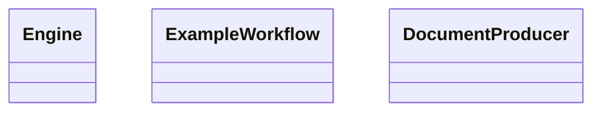
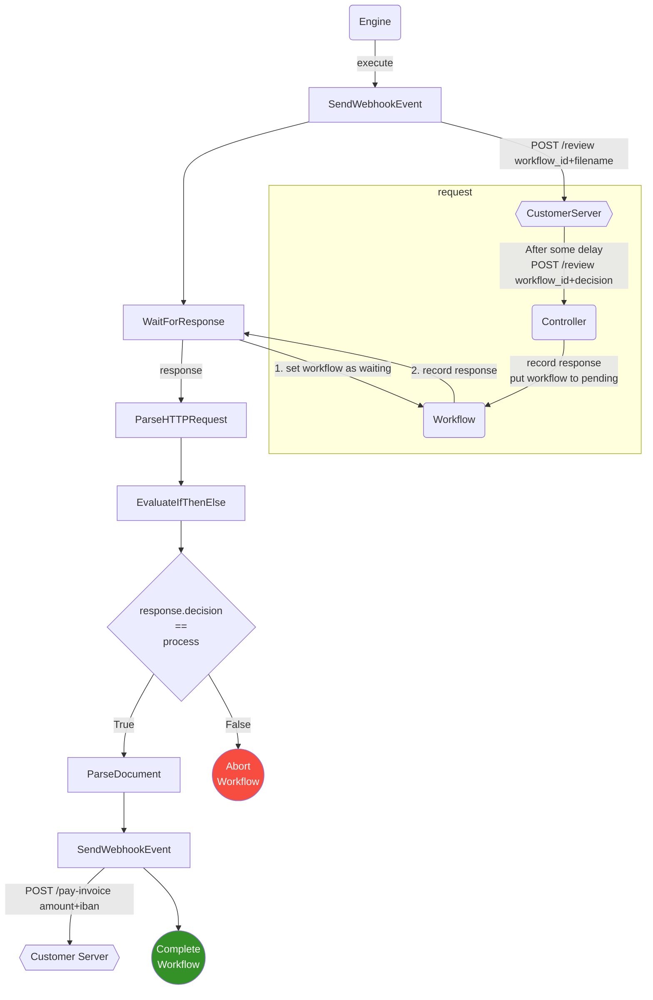

# Document Processing Workflow - Proof of Concept

This repository contains a proof-of-concept, brain-teaser exercise for designing and implementing a document processing workflow. It's an exercise in designing composable workflows that a user can configure through e.g. a UI and that can be used immediately without the need of a code release.

> I implemented this as an exercise in Software Architecture. You may use this solution in your own product, but please let me know which challenges you encounter so that I can improve the architecture. Thanks!

## Architecture Overview

The (self-imposed) requirements of the document parsing workflow architecture were:

1. Workflows need to be composable and user-configurable.
2. New workflows can be configured and used without a code release.
3. Workflows can be suspended (stopped) and re-queued (restarted).
4. Workflows can be aborted early without executing all remaining commands.
5. Workflow steps can be easily added or modified.
6. Workflows can be executed in parallel.

Based on these requirements, I designed a solution that revolves around a few key elements:

### `Workflow`. 
A workflow describes the document processing flow from start to end. Every new document receives one `Workflow`. The workflow is executed by the `Engine` and its state is persisted by the `Workflows` context. 

A workflow has multiple `steps`, which are a list of `Commands`. The commands can be configured by the user. When a workflow is executed by the `Engine`, every command is execute in order and receives the output result of the previous command.

The status of a workflow can be `:pending`, `:running`, `:waiting`, `:aborted`, or `:completed`. After the workflow is created, it is waiting to be executed by the `Engine`. While it is waiting, it has the status `:pending`. Once the engine starts executing the worflow, the workflow status becomes `:running`. A workflow can be `:aborted` early if a command returns `:abort`. The workflow can also be suspended by a command that returns `:wait`. If a workflow is waiting, it can be unsuspended by changing its status back to `:pending`. The `Engine` will then pick up the workflow again. While a workflow is `waiting`, it will not be executed by the `Engine`. Once every step in the workflow has been executed successfully, the workflow is `:completed`. 

### `Command`
A command respresents a single step in a `Workflow`. Every command has a command `module` that implements the logic of the command. Commands can be configured through a `params`-map. See the `Mock.ExampleWorkflow` for examples of how to create a workflow with multiple commands. 

When a command is executed by the `Engine`, the command `module` receives the command, the workflow, and the result of the previous command. The command module executes the command logic based on the input and returns either `{:ok, result}` or `{:error, any()}`. The `result` can be anything, but special return values are `:wait` and `:abort`. A command can return `{:ok, workflow, :wait}` if it wants that the workflow waits for an input from an external service like a customer's server or a user input in a UI. If a command wants to abort the workflow, it can return `{:ok, workflow, :abort}`. 

Every command stores its result so that we can see later which command/step in a workflow returned which result.

### `Engine`
The engine executes a workflow. It iterates through all commands of a workflow until one of the following exit conditions occurs:
1. All commands of the workflow were completed successfully.
      * In this case, the engine completes the workflow (sets the workflow status to `:completed`).
2. The workflow was aborted.
      * In this case, the engine aborts the workflow (sets the workflow status to `:aborted`).
3. The workflow was instructed to wait.
      * In this case, the engine suspends the workflow (sets the workflow status to `:waiting`).

The engine executes every command in the workflow and stores the result of the execution on the command. If a command instructs the workflow to wait, that command is set to `:waiting` and it will become the first command to be executed once the workflow is re-queued because a response has come in.

If the engine re-runs a workflow, it will skip any `:completed` commands and will continue the execution of the workflow with the first command that is `:waiting`. 

### Module Dependency Diagram
Here's a rough dependency diagram between all the modules in this proof-of-concept: 



## Example Workflow

The example workflow implemented in the Proof of Concept involves a simulated invoice that the system should process and instruct a customer server to pay out. There's a flow diagram below, but these are the general steps in the workflow:

Once a new document was received and a workflow was created, these are the steps executed by the `Engine`:
1. Send a review request via HTTP to a customer server.
2. Suspend the workflow until the customer server responds with a decision about how to proceed with the given document.
3. Once the customer server responds with a decision, re-queue the workflow.
4. If the decision is to "process" the document, parse the document. If the decison is not to "process" the document, abort the workflow.
5. After the parsing of the document, send a HTTP request to the customer server with information about the `amount` of the invoice and the recipients `IBAN`.
6. End the workflow.



### Example Workflow Output

I ran the server and recorded the logs for one workflow. You can see how the workflow is created, how a request is sent to the customer server, how the workflow is suspended until the server resopnds, how the server responds with a decision, how the workflow is re-queued together with the responds of the customer server, and how the customer server is eventually instructed to pay out an amount to a given IBAN.

```
11:10:36.862 [debug] Created new workflow for document: file-984.pdf
 
11:10:36.895 [debug] Marking Workflow 1be190cb-e401-48b6-b568-0f0351994eec as running
 
11:10:36.895 [debug] Marking Command 0 - Elixir.Demo.Commands.SendWebhookEvent as completed

11:10:36.895 [debug] Marking Command 1 - Elixir.Demo.Commands.WaitForResponse as waiting

11:10:36.895 [debug] Marking Workflow 1be190cb-e401-48b6-b568-0f0351994eec as waiting

11:10:36.895 [debug] Customer Server: Received a Review Request for Workflow 1be190cb-e401-48b6-b568-0f0351994eec
 
11:10:38.896 [debug] Customer Server: Sending Response for Review Decision for Workflow: 1be190cb-e401-48b6-b568-0f0351994eec - process
 
11:10:38.896 [debug] Marking Workflow 1be190cb-e401-48b6-b568-0f0351994eec as pending
 
11:10:38.897 [debug] Marking Workflow 1be190cb-e401-48b6-b568-0f0351994eec as running
 
11:10:38.897 [debug] Marking Command 1 - Elixir.Demo.Commands.WaitForResponse as completed

11:10:38.897 [debug] Marking Command 2 - Elixir.Demo.Commands.ParseHTTPRequest as completed

11:10:38.897 [debug] Marking Command 3 - Elixir.Demo.Commands.EvaluateIfThenElse as completed

11:10:38.897 [debug] Marking Command 4 - Elixir.Demo.Commands.ParseDocument as completed

11:10:38.897 [debug] Marking Command 5 - Elixir.Demo.Commands.SendWebhookEvent as completed

11:10:38.897 [debug] Marking Workflow 1be190cb-e401-48b6-b568-0f0351994eec as completed

11:10:38.897 [debug] Customer Server: Received an Invoice Pay Request over 6500 to NL02ABNA674855481 
```

## Design Decisions

### Sync vs Async Commands
The application only supports sync commands for now, but implements async commands using three sync commands: `SendWebhookEvent`, `WaitForResponse`, `ParseHTTPRequest`. Having three separate commands adds flexibility for which async action we wait for, but it would probably be better UX to have async commands in the future that wrap multiple sync commands.

### Access Paths
To access fields in the workflow, document, or previous result, a user can configure a Command through an access path like e.g. `["workflow", "id"]`, `["document", "parsed_content", "amount"]` or `["previous", "decision"]`. Although some fields that can be accessed are atom-based keys in a struct, like `:workflow` and `:document`, I decided to only allow string-based keys in the access path. 

The reason for this is that we would probably receive the access path from some kind of UI through a Websocket connection or HTTP Request. That means that when the access path is transmitted through e.g. a Websocket connection, any atom-based keys would be converted into string-based keys. If we wanted mixed keys, we'd have to manually convert these keys back into atom-based keys. 

Secondly, if we'd store the access path in a database, any atom-based key would also get converted into string-based keys. So, keeping the access path keys string-based, we prevent a lot of back-and-forth converting between atom and string-based access keys.

### Workflow Persistence
For this Proof of Concept, no persistence layer has been implemented. However, all used structs could be easily converted into Ecto Schemas except for the `Workflow` struct, whose `steps` field would need to be serialized in a way that allows the reconstruction of the Command module and its parameters. One option for this is to call `String.to_existing_atom/1` on the stored module name. This returns the module name as atom which can be used for calling the `execute/3` function on it.

```elixir
iex(1)> module_name = to_string(Demo.Commands.SendWebhookEvent)
"Elixir.Demo.Commands.SendWebhookEvent"
iex(2)> module = String.to_existing_atom(module_name)          
Demo.Commands.SendWebhookEvent
```

## Complexity that was left out
I left out the following features because they were irrelevant for this proof of concept, but they would need to be implemented for production use:
1. Authentication in the Controller.
2. The decision which workflow to use for which user and/or document type. Right now, only one workflow is used for all documents, but a decision strategy would be necessary to decide which workflow should be chosen for which document.
3. How to scale the `Engine`. The engine is a single GenServer for now, but could be scaled to a pool of genservers that all pull pending workflows from the `Workflows` context. But a proper scaling strategy would be needed that also handles errors better.
4. How to store the workflows. For this proof of concept, the workflows are stored in a GenServer instead of in a persistance level like e.g. a Postgres database. One would need to figure out how to store workflows better.

## Considerations for further Research

### 

### Nested Workflows
It would be interesting to investigate how to support workflows that have multiple paths. As an example, think about a workflow where we automatically instruct an external service to pay an invoice, but only if the amount is less than $1000. If the amount is higher, a user needs to approve the amount first. This secondary workflow could be wrapped in its own nested workflow.